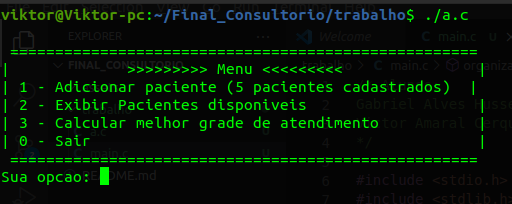
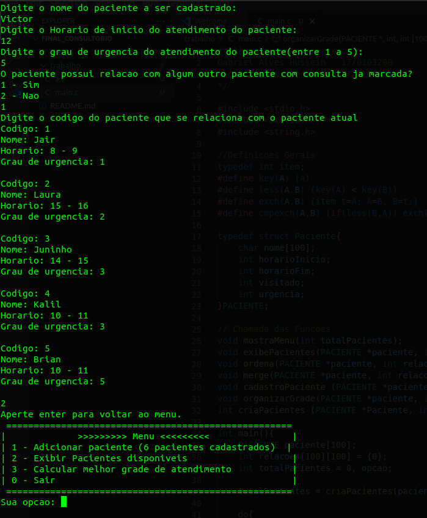
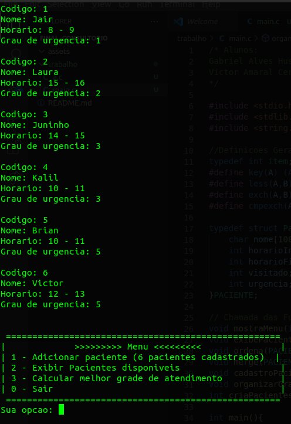
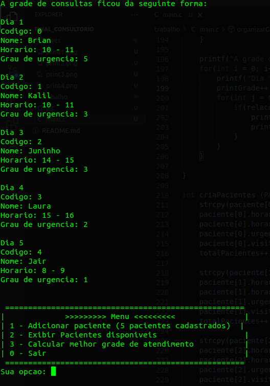

# Consultorio

**Conteúdo da Disciplina**: Trabalho Final - weighted interval schedule + grafos em matriz + Merge Sort 

## Alunos
|Matrícula | Aluno |
| -- | -- |
| 17/0103200  |  Gabriel Alves Hussein |
| 17/0164411  |  Victor Amaral Cerqueira |

## Sobre 
Um doutor precisa que voce organize a agenda semanal dele baseado no grau de urgencia dos pacientes e a relacao entres os pacientes que irao visitar seu consultorio, afim de poupar tempo.

## Screenshots

## Instalação 
**Linguagem**: C 

## Uso 
Compilar o arquivo main.c com o comando "gcc main.c -o a.c"
Executar o arquivo a.c com o comando "./a.c"